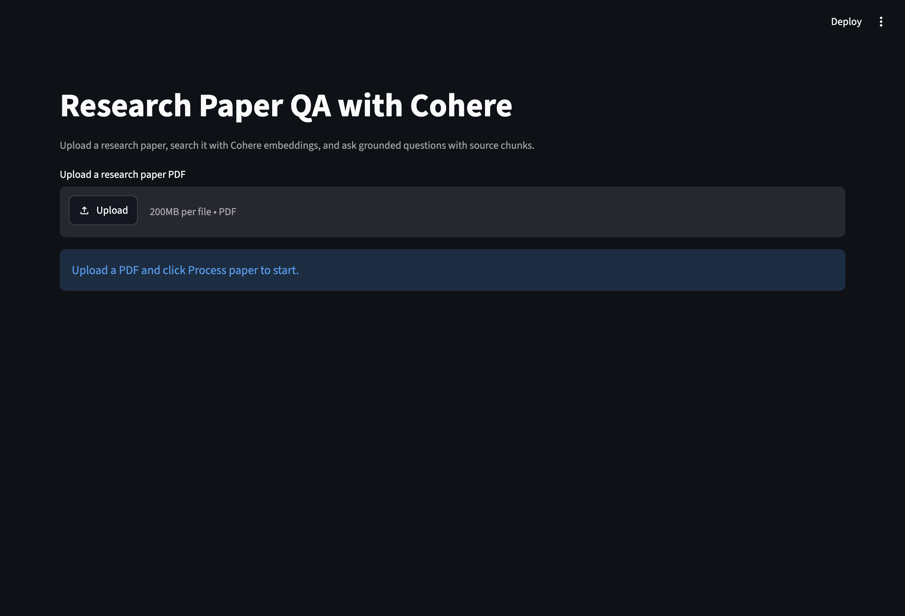
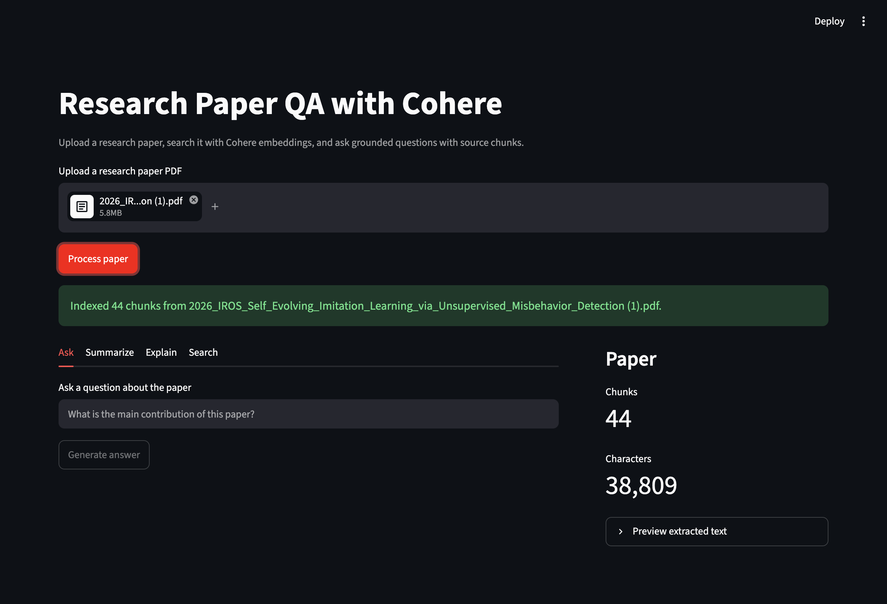
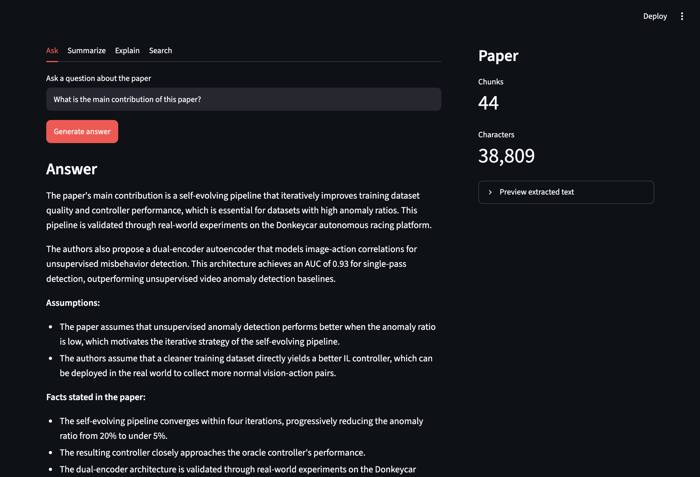
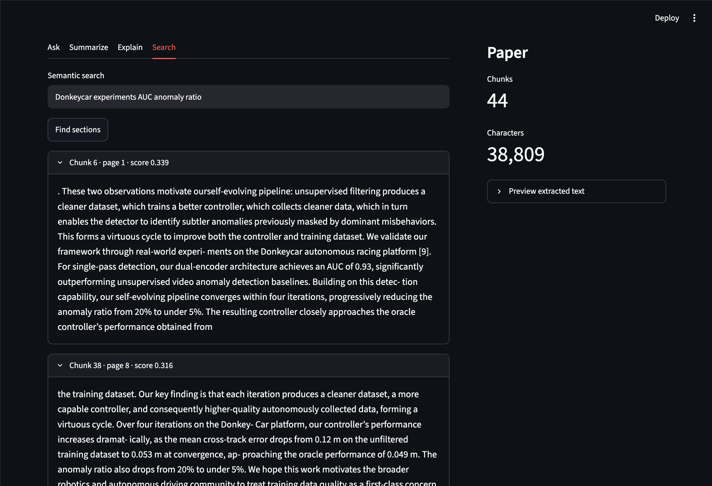

# Research Paper QA with Cohere

A lightweight research paper assistant that lets users upload a PDF, build a semantic search index with Cohere embeddings, and ask grounded questions using retrieval-augmented generation (RAG).

This project is designed as a portfolio-ready AI Engineer / ML Engineer demo. It is more focused than a generic chatbot because it combines PDF parsing, chunking, vector search, RAG prompting, and source chunk display.

## Features

- Upload a research paper PDF
- Extract and chunk paper text
- Generate document embeddings with Cohere Embed
- Store vectors in a FAISS index
- Ask questions about the paper with Cohere Command
- Summarize the paper
- Explain difficult concepts from the paper
- Run semantic search over related sections
- Display retrieved source chunks with page and similarity score

## Tech Stack

- Python
- Streamlit
- Cohere API
- LangChain text splitter
- FAISS
- pypdf

## Project Structure

```text
cohere-paper-assistant/
├── app.py
├── utils.py
├── docs/
│   └── screenshots/
│       ├── home-upload.png
│       ├── upload-indexed.png
│       ├── ask-answer.png
│       └── semantic-search.png
├── requirements.txt
├── README.md
├── .env.example
└── .gitignore
```

## Setup

1. Clone the repository.

```bash
git clone https://github.com/syuhueihuang/cohere-paper-assistant.git
cd cohere-paper-assistant
```

2. Create and activate a virtual environment.

```bash
python -m venv .venv
source .venv/bin/activate
```

3. Install dependencies.

```bash
pip install -r requirements.txt
```

4. Add your Cohere API key.

```bash
cp .env.example .env
```

Then edit `.env`:

```text
COHERE_API_KEY=your_actual_key_here
```

5. Run the app.

```bash
streamlit run app.py
```

## Streamlit Cloud Deployment

1. Push this project to GitHub.
2. Go to [Streamlit Community Cloud](https://streamlit.io/cloud).
3. Create a new app from your GitHub repository.
4. Set the main file path to:

```text
app.py
```

5. Add your Cohere key in Streamlit secrets:

```toml
COHERE_API_KEY = "your_actual_key_here"
```

6. Deploy the app.

## Screenshots

### Home Page



### Upload and Index Paper



### Ask a Question



### Semantic Search



## Portfolio Description

I built a lightweight Research Paper Assistant using Cohere's API that helps users summarize research papers and ask questions through retrieval-augmented generation. The system extracts text from uploaded PDFs, splits the paper into chunks, creates semantic embeddings with Cohere Embed, stores them in FAISS, and generates grounded answers with Cohere Command while showing retrieved source chunks.

GitHub: https://github.com/syuhueihuang/cohere-paper-assistant

## Notes

- For best results, upload text-based PDFs rather than scanned image PDFs.
- The app uses Cohere `embed-v4.0` by default for semantic search.
- The chat model is configurable in the sidebar.
